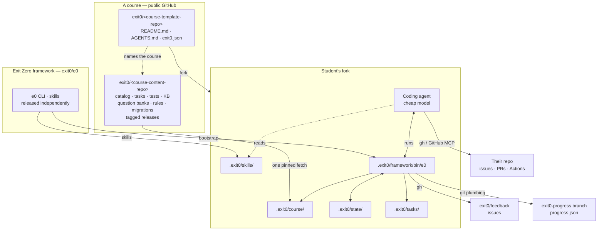

# Exit Zero — Agent-Native Learning Framework Design Spec

**Date:** 2026-08-09
**Status:** Approved
**Supersedes:** `2026-07-05-agent-tutor-design.md` (server-side LangGraph tutor)

---

## Overview

Replace the frontend-driven learning experience with an agent-native one. The student forks a
template repo, opens it in their IDE, and says "hi" to whichever coding agent they already
use — Copilot, Claude Code, Codex. Everything after that happens in the chat: tasks arrive
personalized on disk, tests come with them, the knowledge base is there when they want it, and
the agent reviews their pull request and then quizzes them on their own code.

There is no frontend, and within this scope no backend either. Course content lives in a public
GitHub repo. Learner state lives in the student's own repo. All deterministic work runs in a
local CLI.

**Relationship to the existing codebase.** Nothing that exists today is modified. The Next.js
frontend, `user-management`, `auth-sidecar`, and `pr-evaluation-action` belong to the
frontend-native approach and are left exactly as they are — not migrated, not retired, not
refactored. All new work lands in new directories and new repositories. No existing course is
ported as part of this design either; the first content is authored fresh against the new
format.

### Goals

- The learning loop never stalls — no auth wall, no network dependency, no wrong-tool dead end
- Course content is personalized in *presentation* only; pedagogy is byte-for-byte preserved
- Progression, grading, and scheduling are deterministic, not model judgment
- Progress survives a fresh clone on a new machine
- Works identically across coding agents
- Cheap model (Haiku, GPT-mini) to is enough run the whole experience

---

## Terminology

Exit Zero is a **framework**, not a course. It hosts many courses, and knows nothing about any
of them beyond the shape of their content.

| Term | Means |
|---|---|
| **Exit Zero** (`exit0`) | The learning framework. Course-agnostic. |
| **`e0`** | The framework's CLI. One implementation, serving every course. |
| **Course** | Something the framework hosts — `polybot`, `polyAIdev`, `MIT2026AIBootcamp`. |
| **Framework repo** | `exit0/e0` — the CLI and the skills that drive it. Released independently. |
| **Course content repo** | `exit0/<course-content-repo>` — tasks, tutorials, question banks, checks, catalog. One per course. |
| **Course template repo** | `exit0/<course-template-repo>` — what a student forks. One per course. |
| **Student fork** | The student's own copy of a course template repo. Where all their work and state lives. |

Two consequences of the split are load-bearing throughout this document:

**The framework ships separately from the courses.** A fix to `e0` reaches every course without
republishing any of them, and a new course needs no change to `e0`. Compatibility is declared,
not assumed: a course's catalog states the minimum framework version it needs.

**Skills belong to the framework.** "Run `e0 start`, then `e0 verify`" is identical whether the
student is doing polybot or an MIT bootcamp. Procedure ships with the CLI it describes. A course
may add its own skills on top, but does not restate the framework's.

---

## Design Principles

**Determinism in data, fluency in the model.** The system supplies content, learning flow, MCQs, tests and rules. The model's entire job is to personalize this data to match the student's context. When the agent says "task 3 depends on task 2," it read that from
`catalog.json`; it did not infer it. This is what allows a cheap model (Haiku, GPT-mini) to run
the whole experience. The `session` skill opens by recommending they switch
their agent to its cheapest model.

**Local-first and rebuildable.** Everything under `.exit0/` can be deleted and reconstructed
from the course content repo plus one committed progress file. No state is born locally.

**Advisory, not blocking.** A student who wants to attempt task 60 after task 1 may. The system
warns, explains, records the override, and gets out of the way.

**Detected facts vs. student-set facts.** `profile.json` holds two different kinds of fact, and
the system must not confuse them. Some facts `e0` can observe on its own — the operating system
is the only one so far. Everything else — which shell the student ends up running in, which test
framework the course has them adopt — is set explicitly, by the student or by an onboarding task,
via `e0 profile set <key> <value>`. `e0` never guesses at a fact it cannot reliably observe, and
never silently records one the student hasn't confirmed. A course that needs a student on a
specific shell (say, Windows students working through WSL in a DevOps course) teaches that as
part of an onboarding task — using the existing `os`-keyed variant mechanism to give OS-specific
instructions — and has the student (or the agent, once setup is confirmed) record the outcome
with `e0 profile set shell bash`. No separate mechanism is needed.

**Plain, respectful language.** Every word the student reads — CLI messages, READMEs, skills,
task text `e0` itself owns — is written for someone who is still learning English, not just
still learning to code. Short sentences. Common words. No idioms, no cleverness, no jargon
without an explanation. State what happened and why it matters, plainly. This is not a tone
preference; it is a way of taking the student's learning process seriously.

---

## Architecture



Four planes:

| Plane | Location | Contents | Trust |
|---|---|---|---|
| **Framework** | `exit0/e0` | The CLI and its skills | Course-agnostic, versioned independently |
| **Course** | Course content repo | Tasks, tests, KB, question banks, catalog, rules, migrations | Source of truth for one course |
| **Working copy** | `.exit0/`, gitignored | Fetched framework and course, personalized tasks and tutorials, local event log | Disposable |
| **Progress** | `exit0-progress` orphan branch | Minimal resumable state | Portable |

---

## Framework Repo

```
exit0/e0/                                  # public, tagged releases
  bin/e0                                   # the CLI — curled at bootstrap
  skills/                                  # procedure → synced to .exit0/skills/
    session.md
    working-on-a-task.md
    using-the-knowledge-base.md
    reviewing-a-pr.md
    comprehension-check.md
    giving-feedback.md
    keeping-current.md
  personalization.md                       # the contract, human-readable
```

Nothing here mentions any course. `e0` is released on its own cadence, and every hosted course
picks it up without republishing.

---

## Course Content Repo

One per course, published independently of the framework.

```
exit0/<course-content-repo>/               # public, tagged releases
  catalog.json                             # course metadata, tasks, deps, relatedTopics
  rules.md                                 # course-wide conduct rules
  skills/                                  # OPTIONAL course-specific skills, layered on top
  migrations/
    2026.08.md                             # per-version migration steps
  knowledgebase/
    index.json                             # title + topics[] + summary per tutorial
    intro-to-linux/
      tutorial.md                          # canonical, with region markers
      questions.json                       # this topic's question bank
  tasks/pd010/
    task.md                                # canonical, with region markers
    rules.md                               # task-specific implementation + review rules
    questions.json                         # this task's question bank
    checks/
      checks.json                          # run command + per-file sha256
      test_endpoints.py
```

A course's `skills/` directory is optional and additive. Framework skills are copied first, then
course skills over them, so a course can add guidance but never has to restate the basics.

`catalog.json` carries the course's identity, its compatibility floor, and its dependency graph:

```json
{
  "contentTag": "v2026.08",
  "requiresE0": "1.0",
  "course": {
    "id": "polybot",
    "title": "The Polybot Service",
    "feedbackRepo": "exit0/feedback"
  },
  "tasks": [
    { "id": "PD010", "title": "Extend the YoloService API",
      "description": "Add a new endpoint…", "labels": ["Python", "FastAPI"],
      "dependsOn": [], "order": 1,
      "relatedTopics": ["intro-to-development-with-python", "http-protocol"] }
  ]
}
```

`relatedTopics` names the knowledge base topics a task touches. It is load-bearing in two places: the task document lists these topics so the
student can read ahead if they choose, and it selects which knowledge base questions are asked
during the task's comprehension check.

### Content format

All content is **GitHub-flavored Markdown**. Content must render correctly in VS Code's Markdown
preview, on github.com, and in a chat transcript. 

### Question identity

Question IDs are `sha1(prompt)[:8]`. Stable across reordering, and an edited question becomes a
new question — which is correct, since spaced-repetition history for the old wording no longer
applies.

---

## Course Template Repo and Bootstrap

The template repo is deliberately thin — the course project skeleton, a short `README.md`, the
agent instructions, and one file naming the course:

```
exit0/<course-template-repo>/
  README.md                    # how to start, in a few lines
  AGENTS.md                    # CLAUDE.md and .github/copilot-instructions.md point at it
  exit0.json                   # which course this is
  <course project skeleton>
```

`exit0.json` is how a course-agnostic framework learns which course it is running:

```json
{
  "courseRepo": "https://github.com/exit0/polybot-content.git",
  "templateRepo": "https://github.com/exit0/polybot-template.git"
}
```

`templateRepo` is the URL of this template repo itself.

**`e0` is not vendored here.** A forked copy would freeze at whatever version the student forked
on, and anyone who never updated would stay frozen indefinitely. It is cloned from the framework
repo's latest release at bootstrap into gitignored `.exit0/framework/`, and runs from
`.exit0/framework/bin/e0`. Because the framework is released independently of any course, one
`e0` fix reaches every student of every course. Cloning the whole repo there, rather than
copying out just the CLI and its skills, keeps bootstrap to one command and gives `e0 init` a
fixed place to find the framework's own skills — no separate dev-only override needed.

Compatibility runs the other way: a course's `catalog.json` declares `requiresE0`, and `e0`
refuses — clearly, with guidance — to run a course that needs a newer framework than the one
installed.

The README's only job is to get the student to open the repo and say hi. Everything else —
installing `e0`, fetching the framework's skills and the course's content, detecting the
toolchain, orienting the student — is the agent's work:

> ## Getting started
>
> 1. Fork this repository and clone your fork.
> 2. Open it in VS Code, or your editor of choice.
> 3. Open the chat panel and say "hi".
>
> That's it. Your agent takes it from here.

This puts two requirements on `AGENTS.md`:

1. It must be self-sufficient *before* `.exit0/` exists. The bootstrap commands live there
   because the skills directory does not yet exist.
2. It must be short. Students may freely modify `AGENTS.md` during the course — adding their
   own project instructions or adapting it to their workflow. The framework asks only for one
   short section: read `.exit0/skills/session.md` at the start of every session.

All session behavior — every-session rules, the loop description, the content rules, the
model suggestion — lives in the `session` skill, which acts as the **gate skill**:
every agent session is routed through it. A student who replaces the pointer section in
`AGENTS.md` loses only that line; the skill itself is untouched in `.exit0/`.

---

## The `.exit0/` Working Directory

```
.exit0/                          # gitignored in its entirety
  README.md                      # what this is; the social contract; do not edit
  framework/                      # the e0 CLI itself, cloned whole at bootstrap
    bin/e0                       # single-file Python 3, stdlib only
    skills/                      # the framework's own skills, read from here
  course/                        # pinned copy of the course content repo @ tag
  skills/                        # framework skills, plus course skills layered over them
  state/
    profile.json                 # os, shell, tooling, user-observed facts
    events.jsonl                 # append-only local history
  tasks/pd010/
    task.md                      # personalized — what the student reads
    task.canonical.md            # original, for verification
    checks/                      # tests + hashes
  knowledgebase/intro-to-linux/
    tutorial.md                  # personalized
    tutorial.canonical.md        # original, for verification
```

`.exit0/` is gitignored. 

---

## The `e0` CLI

Single-file Python 3, standard library only, no install step. Works on macOS, Linux, and
Windows.

**Hard requirement: `e0` never crashes.** No stack traces, no non-zero exits, no unhandled
exceptions. Every failure mode returns actionable text the agent can read aloud. Since `e0` is
the only path to deterministic logic, its reliability *is* the no-dead-ends guarantee, and its
unit tests are part of the product.

| Command | Behavior |
|---|---|
| `e0 init` | Detect the OS; fetch content at latest tag; restore `progress.json` from `origin/exit0-progress` if present; write `.exit0/` |
| `e0 status` | Current task, what's next and why, pending comprehension checks, questions due for re-ask. Checks for a content update on a best-effort basis — offline or unreachable is reported as "unknown", never as an error |
| `e0 catalog` | Every task with status and dependencies |
| `e0 start <id>` | Advisory dependency check; copy canonical task + checks; verify check hashes; emit the personalization payload and the issue title/body for the agent |
| `e0 read <topic>` | Copy a KB tutorial into `.exit0/knowledgebase/` for personalization |
| `e0 verify <path>` | Diff a personalized document against its canonical; reject and restore changes outside declared regions |
| `e0 check [id]` | Run the task's local checks; hash-verify test files first and warn on drift |
| `e0 review <id>` | Report PR state via `gh`; emit the diff plus applicable conduct and task rules |
| `e0 pr-comment <id> --from <file>` | Post the agent's composed review to the PR via `gh`; record which conduct rules were delivered |
| `e0 questions <id>` | Emit the task's question set — its own bank plus related-topic questions — decoded, without answers |
| `e0 answer <id> <qid> <choice>` | Grade by hash; record; schedule next occurrence |
| `e0 complete <id>` | Record completion; requires the task's PR to be closed |
| `e0 feedback --about <ref> --from <file>` | Open a feedback issue in the public feedback repo via `gh`, with the content reference and version attached |
| `e0 profile get\|set <key> [value]` | Read or record an observed fact |
| `e0 update` | Compare pinned tag to latest; list added/changed tasks; run migrations |
| `e0 sync` | Write `progress.json` to the orphan branch and push |

`start` is advisory: an unmet dependency prints a warning, records an `override` event, and
proceeds.

### School checks, locally and in CI

Checks ship with the task and run locally via `e0 check` from the moment it starts — that is what
makes the loop genuinely test-driven. Early in the course, a dedicated task has the student wire
those same checks into a GitHub Actions workflow in their own repo, alongside tests they write
themselves.

From that point every task is verified twice: locally while developing, and in CI on the pull
request. Wiring up CI is *course content*, not platform infrastructure — the student builds it during the course with a dedicated task on it.

### Completion

A task is complete when **its pull request is closed** (except maybe the first few tasks where students have not yet learned what PR is), as follows:

1. School checks pass, locally and in CI
2. The student's own tests pass
3. The agent's PR review has been addressed
4. Comprehension questions have been answered — **not required for completion**

`e0 complete <id>` reads PR state via `gh` and records it. If the PR is still open, it says so
and declines to record — but it never blocks anything.

Starting a new task while the previous one is incomplete is permitted and recorded as an
override. The agent says plainly what is being skipped and why it matters professionally, then
helps anyway. The student is an adult; they are told the cost and left to decide.

---

## Personalization Contract

The guardrail is not an instruction the model might rationalize past. It is a set of **declared
editable regions**, with everything else frozen and mechanically verified.

This applies identically to tasks and to knowledge base tutorials. Both are canonical documents
with region markers; both get a `.canonical.md` sibling; both are checked by `e0 verify`. A
tutorial personalized for a student who already knows Linux can carry a "skim this" annotation,
but its explanations cannot be rewritten.

### Region markers

```markdown
Install the tool:

<!-- e0:variant id="install-ffmpeg" -->
brew install ffmpeg          <!-- when: os=macos -->
sudo apt install ffmpeg      <!-- when: os=linux -->
choco install ffmpeg         <!-- when: os=windows -->
<!-- /e0:variant -->

<!-- e0:retone based-on="the students' Linux knowledge" -->
Please carefully review the Linux tutorial before proceeding. It covers the commands you'll need to use in this task.
<!-- /e0:retone -->


Build the agent using **langchain**.
```

`retone` is used to let the agent personalize a document with student-provided context. E.g. If the user says he is very strong in Linux, the agent can fill in the `e0:retone` block with a note that the student can skim the Linux tutorial. The agent never invents content on its own.

Markers are HTML comments — invisible in any Markdown preview, and present in both the
canonical and personalized files so `verify` can align them.

### Permitted operations

| Operation | Rule |
|---|---|
| **select** | Choose one branch of an `e0:variant` from the declared options. Never invent a branch. |
| **retone** | Fill/Adjust prose instructions/verbosity. |

Everything else is forbidden by construction, not by instruction. "Build the agent using
**langchain**" is not protected by a rule — it simply is not inside an editable region.

`e0 verify` enforces the contract

A violation causes `e0` to restore the canonical text for that span and report what overstepped.
The `working-on-a-task` skill instructs the agent to run `verify` as the final step of `start`,
so it self-corrects before the student sees the file.

---

## PR Review and Conduct Rules

Rules live in two places: `rules.md` at the course content repo root holds course-wide conduct
rules, and `tasks/<id>/rules.md` holds implementation and review rules for one task. Both feed
the review.

### The "I finished" flow

When the student says they are done, the agent runs `e0 review <id>`, which reports PR state:

| PR state | Response |
|---|---|
| No PR | Explain what the PR is for here, help them open one |
| Open | Proceed with the review |
| Closed before review | Coach. Closing early skips the feedback loop the workflow exists to provide — explain why, ask them to reopen, and record the rule as taught so it isn't re-explained every task |
| Merged | Review retrospectively — comment for learning, not for change |

`e0 review` returns the diff and the applicable rules; the agent composes the review;
`e0 pr-comment` posts it via `gh` under the student's own identity. Judgment belongs to the
model, posting belongs to `e0`.

The agent then summarizes in chat and hands control back:

> Overall, nice work. I left a few comments on the PR — mostly around error handling in
> `delete_prediction`. I also noticed you're building the SQL query by string concatenation;
> worth re-reading the SQL Injection section of the Databases tutorial. Once you've addressed
> the comments and you're ready, tell me and I'll ask you a few questions about your
> implementation.

Nothing is asked until the student says "ready."

---

## Comprehension Checks

Questions are asked **in the chat**, and only after the review is handed
back and the student says they are ready.

### Where questions come from

Both tasks and knowledge base topics carry question banks. A task's check draws from two places:

| Source | Selection |
|---|---|
| `tasks/<id>/questions.json` | The task's own bank |
| `knowledgebase/<topic>/questions.json` | Only topics listed in the task's `relatedTopics` |

Both task and knowledge base questions are asked in the context of a task, never on
finishing a tutorial.

```json
{ "questions": [
  { "id": "a3f81c2b", "topic": "git", "type": "mcq",
    "prompt": "What does HEAD represent in Git?",
    "options": ["The most recent commit…", "The current branch name",
                "The commit your working directory points at", "The first commit"],
    "answerHash": "9f2c…", "reaskAfterDays": 30 },
  { "id": "77de01aa", "topic": "error-handling", "type": "open",
    "prompt": "What happens if the DB delete succeeds but the file delete fails?",
    "openAnswerOutline": "bla bla",
    "mandatory": true } ]}
```

**Grading.** MCQ is graded by `sha256(option_text)` — deterministic, with no visible answer key
in a public repo. Open questions cannot be graded mechanically but the agent should compare the answer to the outline, and if needed discuss with the student until the concept is resolved; they are recorded as
*discussed*.

**Personalization.** The agent rewrites each question against the student's actual code — citing
a real snippet from their diff instead of asking in the abstract. Option order should change (and the correct answer should be rehashed) to avoid memorization.

**Answering is not required.** Questions are a learning device, not a gate. A student who
declines can proceed; `e0` records that they were offered and skipped, and the questions remain
due.

**Spaced repetition.** Correct answers schedule the next occurrence at a doubling interval
(30, 60, 120 days). Wrong answers reset to a short interval. Passed questions are recorded in
committed progress; failures stay local, so a fresh clone re-asks anything unresolved — the safe
failure direction.

---

## Feedback

Students can leave feedback on anything — a task, a tutorial, one specific MCQ, the course as a
whole. It lands as an issue in a dedicated public repo, opened under the student's own identity
via `gh`.

### Why this fits an agent-native course

Every piece of content already carries a stable identifier: task ids, topic ids, and question ids
that are content hashes. So feedback can point at exactly the thing that provoked it, and `e0`
attaches the reference automatically — the student never has to explain *which* question confused
them, or which step of which task.

| Reference | Means |
|---|---|
| `task:PD010` | A task |
| `topic:intro-to-linux` | A knowledge base tutorial |
| `question:a3f81c2b` | One specific question |
| `course` | The experience as a whole |

Because question ids are content hashes, feedback stays attached to the exact wording that was
criticized. Edit the question and the id changes, so old complaints do not haunt the new version.

### Two ways it starts

**The student volunteers it.** "This task was confusing", "I think that answer is wrong", "this
command doesn't work on my machine". The agent offers to file it, composes the text, shows it,
and posts on confirmation.

**The agent notices friction and invites it.** If a student is visibly frustrated, has failed the
same check repeatedly, or argues with a question's correctness, the agent extends a short
invitation. Four rules keep this from becoming a nuisance:

- **Help first.** Never interrupt an unresolved problem to ask for feedback. Wait until the
  moment passes, then invite.
- **Once per session at most**, recorded in `events.jsonl`.
- **Never twice about the same item.**
- **One sentence.** An invitation, not a survey. The student declining is the normal outcome.

### What gets posted

`e0 feedback --about <ref> --from <file>` assembles the issue: the student's text, the content
reference, the pinned `contentTag`, and the OS. Nothing else — no code, no diff, no answer
history, no progress.

The student sees the exact body before it goes anywhere. This matters because **the feedback repo
is public and the issue carries their name** — better said plainly up front than discovered
afterwards. Truly anonymous feedback would need a backend to relay it, which is outside this
scope.

Issues rather than Discussions for v1, purely for tooling reasons: `gh issue create` is a single
command, while opening a Discussion requires a GraphQL mutation and a category id lookup, which
is more machinery than the feature deserves at the start. Labels carry the content type.
Discussions remain a straightforward upgrade if volume justifies it.

---

## Sync and Update

### Committed progress

```json
{ "contentTag": "v2026.08", "completed": ["PD010"], "inProgress": "PD020",
  "profile": { "os": "linux", "testFramework": "pytest" },
  "questionsPassed": { "a3f81c2b": "2026-07-02" } }
```

Deliberately minimal: enough to resume from a fresh clone, not enough to expose struggle on a
public repo. Wrong answers, attempt counts, and override events stay in local `events.jsonl`.

### Writing it without disturbing the student

`e0 sync` writes an orphan-branch commit using git plumbing. `HEAD` does not move, the index is
not read, and the working tree is untouched — the student can be mid-task on a feature branch
with uncommitted changes and will not notice:

```bash
blob=$(git hash-object -w progress.json)
tree=$(printf '100644 blob %s\tprogress.json\n' "$blob" | git mktree)
commit=$(git commit-tree "$tree" ${parent:+-p $parent} -m "progress: PD010 complete")
git update-ref refs/heads/exit0-progress "$commit"
git push origin exit0-progress
```

The branch holds exactly one file, so there is never a conflict: `e0` reads
`origin/exit0-progress:progress.json`, merges its own state, writes a new commit. Last-write-wins
is correct here. `e0` sets `GIT_AUTHOR_*` and `GIT_COMMITTER_*` explicitly so it works on a
machine with no git identity configured.

### Updates

`e0 update` compares the pinned tag against the latest release and reports added and changed
tasks for the agent to summarize, then applies versioned migration scripts from
`course/migrations/`.

Migrations may only touch `.exit0/` and make non-conflicting (additive if possible) changes. Any migration
touching tracked files requires a clean working tree and explicit student consent. An update can
never collide with in-progress work.

---

## Skills Layer

Skills ship in the **framework** repo and sync to `.exit0/skills/`. They carry procedure; `e0`
carries computation. A course may add its own skills, which are layered on top — but the skills
below are course-agnostic and never restated per course.

| Skill | Covers |
|---|---|
| `session` | The session gate — recommend the cheap model, `e0 init`, every-session rules, orient, first suggestion |
| `working-on-a-task` | `start` → personalize → `verify` → TDD loop with `check` |
| `using-the-knowledge-base` | Fetching a tutorial on request; pointing at covered topics instead of improvising |
| `reviewing-a-pr` | The "I finished" flow, conduct rules, composing and posting the review |
| `comprehension-check` | Asking the task's questions in chat against the student's own code |
| `giving-feedback` | Spotting friction, inviting feedback without nagging, composing and filing it |
| `keeping-current` | The update flow |

The repo root holds `AGENTS.md`; `CLAUDE.md` and `.github/copilot-instructions.md` are
one-line files pointing at it. `AGENTS.md` is short by design: the bootstrap commands for
a fresh clone, and one section — read `.exit0/skills/session.md` at the start of every
session. Students may freely add to or modify this file during the course.

`session` is the **gate skill**. Every session is routed through it. It carries the loop
description, every-session rules, the content rules, the model suggestion, and the steps
for orienting the student. Keeping this in a skill rather than in `AGENTS.md` means a
student who edits `AGENTS.md` does not accidentally lose the framework's session rules.

---

## Conversational Loops

**Onboarding.** Student says "hi". Agent reads `AGENTS.md`, sees the pointer to
`session`, reads it, recommends switching to a cheap model, then runs `e0 init`. `e0` detects the OS and toolchain, fetches content at
the latest tag, restores progress if the orphan branch exists, and returns a state summary. The
agent greets them with where they are and what's next.

**Starting a task.** The agent runs `e0 start PD020` — unmet dependencies produce a warning
relayed honestly ("PD020 builds on PD010 — want to do that first, or push ahead?"). `e0` writes
the canonical task, checks, and personalization payload; the agent applies the contract, runs
`e0 verify`, and opens the issue titled `[PD020] <title>` via `gh` or GitHub MCP under the
student's own identity. The task document lists its related topics; if the student wants to read
one first, `e0 read` fetches it.

**Working.** Tests are on disk from the start, so the loop is genuinely test-driven: read the
failing checks, implement, `e0 check`, repeat. Once the student has wired up CI, the same checks
also run on every push. Hash drift on a check file produces a warning and an offer to restore.

**Asking a question mid-task.** If the knowledge base covers it, the agent says so and points at
the tutorial instead of explaining from scratch — the course's explanation is the one that will
match later tasks.

**Finishing.** The student says they're done. `e0 review` reports PR state; the agent coaches on
conduct if needed, composes the review from the rules, posts it with `e0 pr-comment`, and
summarizes in chat — then waits. When the student says "ready," the agent asks the task's
questions plus related-topic questions, personalized against their own diff. `e0 answer`
grades and schedules. Once the PR closes, `e0 complete` records it and `e0 sync` commits
progress.

---

## Testing Strategy

- **`e0` unit tests** (pytest): every command, every failure mode. Explicit tests that no input
  produces a stack trace or a non-zero exit.
- **End-to-end walkthrough:** fork → init → start → check → answer → sync, against a fixture
  course.

---

## Security Notes

- `e0` executes check commands from `checks.json` in the course content repo. Content is
  first-party and public; students run it in their own environment. Fetches are pinned to a
  release tag and hash-verified.
- Answer hashing and rule encoding are obfuscation, not security. The `README.md` in `.exit0/`
  states this plainly and asks students not to peek. Determined students will look; that is
  acceptable.
- No secrets, tokens, or credentials are stored in `.exit0/` or the progress branch.
- The agent opens issues and PRs under the student's own credentials. No third-party token is
  ever handled by the student's machine.
- Feedback issues are public and attributed. `e0` includes only the student's own text, a content
  reference, the content version, and the OS — never code, diffs, or progress. The body is shown
  to the student before it is posted.
